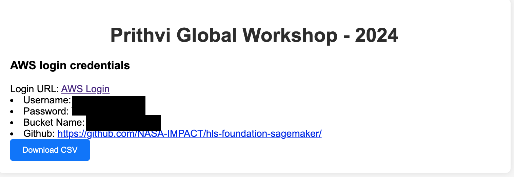
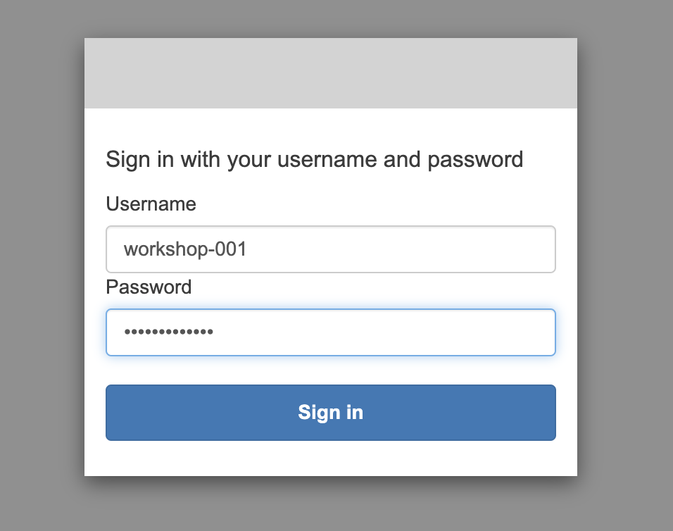
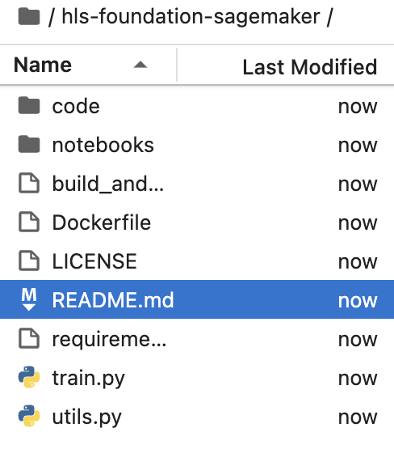

<!---- Provide an overview of what is being achieved in this repo ---->
# Prithvi Finetuning
This repo contains materials for Prithvi Global Finetuning. Here, we will cover geospatial foundation models and Weather Foundation model. We will also be fine-tuning the aforementioned models for specific usecases. For the purposes of this tutorial, we will be utilizing AWS sagemaker environment. The repo will also demonstrate how to get inferences from the fine-tuned prithvi models after the training is complete.

# Slides:
[Geospatial Foundation Model - Dr. Sujit Roy](https://docs.google.com/presentation/d/1i06aDGXIHcXYLqzXNkBRaA4EC3ggpD2E/edit?usp=drive_link&ouid=110979708004719970003&rtpof=true&sd=true)

[Prithvi Weather and Foundation Model - Dr. Rajat Shinde](https://docs.google.com/presentation/d/14jnTbak9xAt36Bfy15oBH8pcR_AiKa9p/edit?usp=drive_link&ouid=110979708004719970003&rtpof=true&sd=true)

# Prerequisites
1. Basic understanding of git
2. Python and jupyter environment knowledge
3. Basic understanding of docker
4. Basic understanding of cloud services
5. Machine Learning knowledge
6. Some understanding of Geo-spatial datasets.

# Getting started
1. Get your credentials and other information using https://creds-workshop.nasa-impact.net/


2. Navigate to [Login URL] https://workshop-domain-3vgdzxn4.auth.us-west-2.amazoncognito.com/login?client_id=6mm4re0d41kcffjp2mlbmtatji&response_type=code&scope=aws.cognito.signin.user.admin+openid+profile&redirect_uri=https://jck7myoluc.execute-api.us-west-2.amazonaws.com/invoke

3. Log in using the credential provided

4. Once the Studio starts, Click on JupyterLab


5. Click `Create JupyterLab Space`

6. Give it a name. Eg: `Workshop`
7. Once initialized, change Instance type to `ml.t3.2xlarge` and storage to `75`

8. Click on `Run Space`. If it throws an error, you might have to pick an Image. The top setting called `Latest` works.


# Steps to Train (Parts of these steps are also available in the [fine-tuning notebook](notebooks/hls-fm-finteuning.ipynb)):
1. Open a new terminal and run the following command to install git lfs

`sudo apt update;sudo apt-get install git-lfs; git lfs install`

2. Clone this repository

`git clone https://github.com/nasa-impact/hls-foundation-sagemaker.git`




**Note: We will follow through in the Notebook from this step.**
3. Change directory into the cloned repository `cd hls-foundation-sagemaker`
4. Open the [fine-tuning notebook](notebooks/hls-fm-finteuning.ipynb)
5. Install required packages
```
pip install -r requirements.txt
```
6. Create required folders
```
!mkdir datasets
!mkdir models
!mkdir configs
```

7. Download HLS Burn scars dataset
```
! cd datasets; git clone https://huggingface.co/datasets/ibm-nasa-geospatial/hls_burn_scars; tar -xvzf hls_burn_scars/hls_burn_scars.tar.gz
```
8. Define constants. **Note: Please update the variables as needed**
```
BUCKET_NAME = '<your-bucket-name>' # Replace this with the bucket name available from http://smd-ai-workshop-creds-webapp.s3-website-us-east-1.amazonaws.com/
CONFIG_PATH = './configs'
DATASET_PATH = './datasets'
MODEL_PATH = './models'
```
9. Download model configuration and pre-trained model from huggingface
```
from huggingface_hub import hf_hub_download

hf_hub_download(repo_id="ibm-nasa-geospatial/Prithvi-100M-burn-scar", filename="burn_scars_Prithvi_100M.py", local_dir='./configs')
hf_hub_download(repo_id="ibm-nasa-geospatial/Prithvi-100M", filename="Prithvi_100M.pt", local_dir='./models')
```
10. Update the configuration file
```
1. Update line number 13 from `data_root = '<path to data root>'` to `data_root = '/opt/ml/data/'`. This is the base of our data inside of sagemaker.
2. Update line number 41 from `pretrained_weights_path = '<path to pretrained weights>'` to `pretrained_weights_path = f"{data_root}/models/prithvi-global-300M.pt"`. This provides the pre-trained model path to the train script.
3. Update line number 52 from `experiment = '<experiment name>'` to `experiment = 'burn_scars'` or your choice of experiment name.
4. Update line number 53 from `project_dir = '<project directory name>'` to `project_dir = 'v1'` or your choice of project directory name.
5. Save the config file.
```
11. Upload downloaded data using sagemaker to the desired s3 bucket
```
import sagemaker

sagemaker_session = sagemaker.Session()
train_images = sagemaker_session.upload_data(path='datasets/training', bucket=BUCKET_NAME, key_prefix='data/training')
val_images = sagemaker_session.upload_data(path='datasets/validation', bucket=BUCKET_NAME, key_prefix='data/validation')
test_images = sagemaker_session.upload_data(path='datasets/validation', bucket=BUCKET_NAME, key_prefix='data/test')
```
12. Rename and upload configuration file and pre-trained model
```
import os

identifier = '<your choice of identifier>' # Please update this with an identifier

config_filename = 'configs/burn_scars_Prithvi_100M.py'
new_config_filename = f"configs/{identifier}-burn_scars_Prithvi_100M.py"
os.rename(config_filename, new_config_filename)

configs = sagemaker_session.upload_data(path=new_config_filename, bucket=BUCKET_NAME, key_prefix='data/configs')
models = sagemaker_session.upload_data(path='models/Prithvi_100M.pt', bucket=BUCKET_NAME, key_prefix='data/models')
```
13. Setup variables for training using Sagemaker
```
from datetime import time
from sagemaker import get_execution_role
from sagemaker.estimator import Estimator


name = f'{identifier}-sagemaker'
role = get_execution_role()
input_s3_uri = f"s3://{BUCKET_NAME}/data"

environment_variables = {
    'CONFIG_FILE': f"/opt/ml/data/{new_config_filename}",
    'MODEL_DIR': "/opt/ml/models/",
    'MODEL_NAME': f"{identifier}-workshop.pth",
    'S3_URL': input_s3_uri,
    'ROLE_ARN': role,
    'ROLE_NAME': role.split('/')[-1],
    'EVENT_TYPE': 'burn_scars',
    'VERSION': 'v1'
}

ecr_container_url = '637423382292.dkr.ecr.us-west-2.amazonaws.com/sagemaker_hls:latest'
sagemaker_role = 'SageMaker-ExecutionRole-20240206T151814'

instance_type = 'ml.p3.2xlarge'

instance_count = 1
memory_volume = 50
```
14. Initialize sagemaker estimator and start training
```
estimator = Estimator(image_uri=ecr_container_url,
                      role=get_execution_role(),
                      base_job_name=name,
                      instance_count=1,
                      environment=environment_variables,
                      instance_type=instance_type)
estimator.fit()
```


# Interacting with the fine-tuned model (Parts of these steps are covered in the [fm-usage notebook](notebooks/hls-fm-usage.ipynb))
1. Install required packages
```
! pip install leafmap numpy --quiet
```
2. Import packages
```
import json
import leafmap
import numpy as np
import xarray as xr
```
3. Set existing events
```
#configure settings for selected events
INFERENCE_URL = 'https://hls-01.workshop.nasa-impact.net'

EVENT_DETAILS = {
    'mongolian_fire': {
        'center_lon': 119.3,
        'center_lat': 47.1,
        'default_zoom': 8,
        'start_date': '2022-04-19T00:00:00Z',
        'end_date': '2022-04-19T23:59:59Z'
    },
    'new_mexico_black_fire': {
        'center_lon': -107.5,
        'center_lat': 33.5,
        'default_zoom': 10,
        'start_date': '2022-05-16T00:00:00Z',
        'end_date': '2022-06-10T23:59:59Z'
    },
    'alberta_fire': {
        'center_lon': -124.2,
        'center_lat': 61.8,
        'default_zoom': 8,
        'start_date': '2023-05-27T00:00:00Z',
        'end_date': '2023-05-28T23:59:59Z'
    },
    'maui_fire': {
        'center_lon': -156.659394,
        'center_lat': 20.886984,
        'default_zoom': 12,
        'start_date': '2023-08-13T00:00:00Z',
        'end_date': '2023-08-13T23:59:59Z'
    }
}

event = 'maui_fire'
event_details = EVENT_DETAILS[event]

#configure settings for selected events
INFERENCE_URL = 'https://hls-01.workshop.nasa-impact.net'

EVENT_DETAILS = {
    'mongolian_fire': {
        'center_lon': 119.3,
        'center_lat': 47.1,
        'default_zoom': 8,
        'start_date': '2022-04-19T00:00:00Z',
        'end_date': '2022-04-19T23:59:59Z'
    },
    'new_mexico_black_fire': {
        'center_lon': -107.5,
        'center_lat': 33.5,
        'default_zoom': 10,
        'start_date': '2022-05-16T00:00:00Z',
        'end_date': '2022-06-10T23:59:59Z'
    },
    'alberta_fire': {
        'center_lon': -124.2,
        'center_lat': 61.8,
        'default_zoom': 8,
        'start_date': '2023-05-27T00:00:00Z',
        'end_date': '2023-05-28T23:59:59Z'
    },
    'maui_fire': {
        'center_lon': -156.659394,
        'center_lat': 20.886984,
        'default_zoom': 12,
        'start_date': '2023-08-13T00:00:00Z',
        'end_date': '2023-08-13T23:59:59Z'
    }
}
```
4. Initialize a map for bounding box selection
```
map = leafmap.Map(
        center=(event_details['center_lat'],
        event_details['center_lon']),
        zoom=event_details['default_zoom'],
        draw_control=True,
        measure_control=False,
        fullscreen_control=False,
        attribution_control=True
    )
map.add_tile_layer(HLSL30_TILE_LAYER, name='HLSL30', attribution='NASA')
map.add_tile_layer(HLSS30_TILE_LAYER, name='HLSS30', attribution='NASA')
map
```
5. Draw a bounding box and save it to `bbox.geojson`
```
map.save_draw_features("bbox.geojson")
```
6. Prepare payload and call API for results using the fine-tuned model
```

def bbox_from_geojson(geojson):
    """
        Get the coordinates of bounding box from an extended notation to flat coordinate
        notation
    Args:
        geojson: File path of geojson

    Returns:
        list: [left, down, right, top]
    """
    with open(geojson) as geojson_file:
        geojson_detail = json.load(geojson_file)
    coordinates = np.asarray(geojson_detail['features'][0]['geometry']['coordinates'])
    lats = coordinates[:, :, 1]
    lons = coordinates[:, :, 0]
    return [lons.min(), lats.min(), lons.max(), lats.max()]

# Convert geojson to flat bounding box representation.
bbox = bbox_from_geojson('bbox.geojson')

import requests
import json

# prepare payload
payload = json.dumps({
  "config_path": f"s3://{BUCKET_NAME}/data/configs/{new_config_filename}",
  "model_path": f"s3://smd-workshop-01/{MODEL_NAME}",
  "model_type": "burn_scars",
  "date": event_details['start_date'].split('T')[0],
  "bounding_box": bbox
})

headers = {
  'Content-Type': 'application/json'
}

# Use deployed app to get inference on the selected date/location
response = requests.request(
      "POST",
      f"{INFERENCE_URL}/infer",
      headers=headers,
      data=payload
  )

predictions = response.json()
```
7. Visualize the result
```
geojson = predictions['predictions']

detection_map = leafmap.Map(
        center=(event_details['center_lat'],
        event_details['center_lon']),
        zoom=event_details['default_zoom'],
        draw_control=True,
        measure_control=False,
        fullscreen_control=False,
        attribution_control=True
    )
detection_map.add_tile_layer(HLSL30_TILE_LAYER, name='HLSL30', attribution='NASA')
detection_map.add_tile_layer(HLSS30_TILE_LAYER, name='HLSS30', attribution='NASA')
detection_map.add_geojson(geojson, layer_name=f"{event}-detections")

detection_map
```
Note: `BUCKET_NAME`, `new_config_filename`, and `MODEL_NAME` are variables set in the previous notebook. Please copy paste those variables here for this step to run smoothly.
